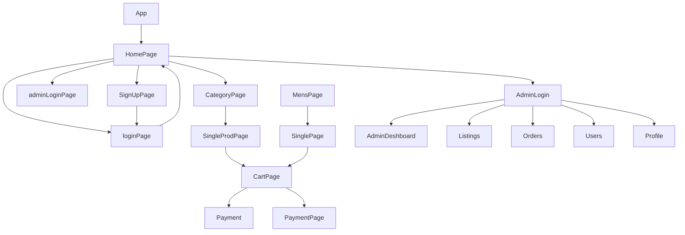

> 💻 CLONED PROJECT NAME⭐ ====>>>> ✨Caratlane💫
>  

## 

---

## 🔗 Collaborators Profile Links✨

| Collaborators                 | Github                                                                                                                                    | Linkedin                                                                                                                                                            | Portfolio                                                                                                                                     |
| ----------------------------- | ----------------------------------------------------------------------------------------------------------------------------------------- | ------------------------------------------------------------------------------------------------------------------------------------------------------------------- | --------------------------------------------------------------------------------------------------------------------------------------------- |
| Aditya Tambe (Team Lead)      |  |   |  |
| Sarfraj Ahmad Raza (Member 1) |    |         |   |
| Kaushik Kumar (Member 2)      |       |  |      |
| Ujjawal Kumar (Member 3)      |    |  |   |
| Rajat Kaswan (Member 4)       |     |   |    |

 
---

## 💫Tech-Stack->

- #### For Frontend :-

  - `HTML5`
  - `CSS3`
     - `JavaScript `
  - `ReactJS`
     - `ES6 `

- #### For Backend :-

  - `NodeJS`
  - `ExpressJS`
    - `MongoDB `

- #### For deploy database :-

  - `cyclic `

- #### For Styling :-

  - `Chakra UI `

- #### For live Project : -
  - `Vercel`

 
---

## Features ✨:-

---

| Serial No | Feature                                                                           |
| --------- | --------------------------------------------------------------------------------- |
| 1         | User signup, User Login, Admin Login                                              |
| 2         | Products Page with Filter by different Category ,Pagination, Sort Functionalities |
| 3         | Dynamic SinglePage & payment feature                                              |
| 4         | Dynamic cart page using userId                                                    |
| 5         | Admin Login & Dashboard Page                                                      |
| 6         | My Account & My Orders Page                                                       |

---

# Package.json(Dependency)✨:-

| Serial No | Backend      | Frontend                     |
| --------- | ------------ | ---------------------------- |
| 1         | bcrypt       | Chakra-ui, mui/material      |
| 2         | mongoose     | React Router dom             |
| 3         | cors         | react-icons, chakra-ui/icons |
| 4         | dotenv       | axios                        |
| 5         | express      | React                        |
| 6         | jsonwebtoken | slick-carousel, react-slick  |

---

## Flow

---

## Screenshots 📷

